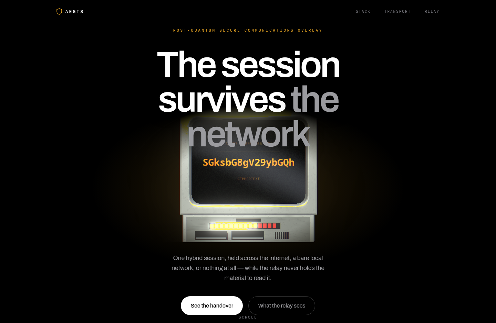
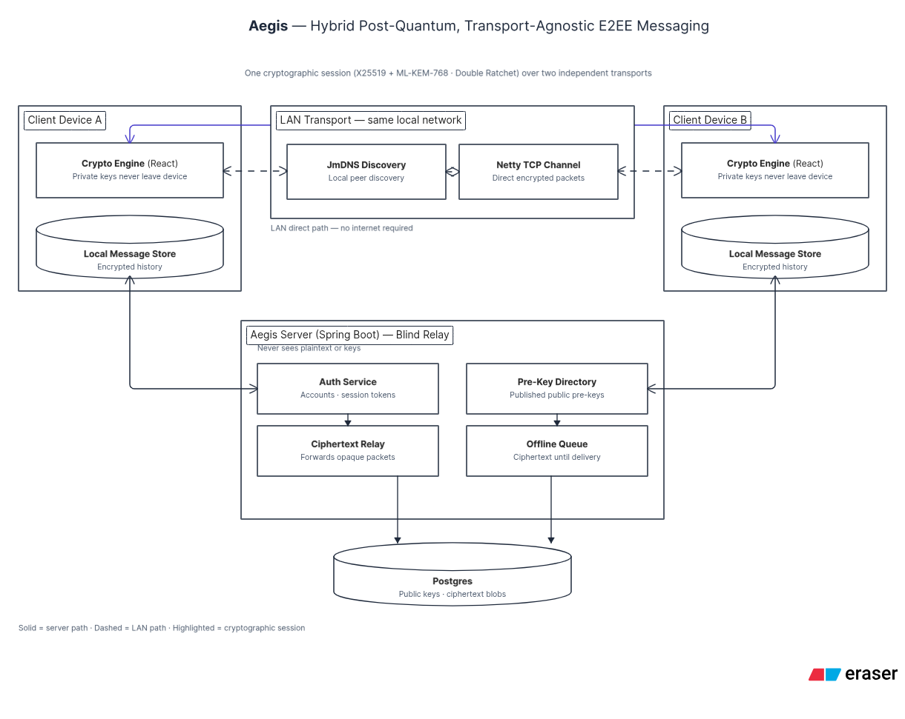

# Aegis — landing page

Marketing site for **Aegis**, a post-quantum secure communications overlay built
for Smart India Hackathon 2026.



## What this is

A single static page that makes three claims, each traceable to a section of
`Aegis_System_Documentation_Manual.docx`:

1. **Hybrid post-quantum key establishment** — X25519 combined with ML-KEM-768.
2. **Transport independence** — one session held across the internet, a direct
   local network, or local queueing, with the crypto engine unaware which is
   carrying it.
3. **A structurally blind relay** — it never receives the material required to
   decrypt what it forwards.

Every claim on the page carries its manual section (`§n`) inline, so the copy
can be checked against the source document rather than taken on trust.

## Design

Cinematic: pure black, one accent (the CRT's amber phosphor), each section
treated as a single shot. The 3D television is the only light source on the
page — it is structural, not decorative.

The full specification, including tokens, motion rules and the copy rules the
page must obey, is in [DESIGN.md](DESIGN.md).

## Stack

| | |
|---|---|
| Framework | Next.js 15, App Router, static export |
| Styling | CSS Modules driven by `styles/tokens.css` |
| 3D | three.js — two canvases, both lazily loaded |
| Type | Archivo + IBM Plex Mono via `next/font` |

Three.js is kept out of the initial bundle behind a dynamic import, and the
whole WebGL layer is gated: no canvas is created under `prefers-reduced-motion`,
Save-Data, low device memory, or without WebGL2. The page is complete without it.

## Running it

```bash
npm install
npm run dev      # http://localhost:3001
```

```bash
npm run build    # static export to ./out
```

## Layout

```
app/          routes, layout, global styles
components/   sections, header, effects
gl/           three.js scenes — crt.ts (hero), tiles.ts (stack objects)
content/      all page copy, keyed by manual section
styles/       design tokens and CSS modules
docs/         reference renders
```

## Architecture



## Team

| | |
|---|---|
| Team | QUBIT |
| Problem statement | SIH26237 — Post Quantum Secure Communication Overlay |
| Theme | Cybersecurity |
| Institution | Vishwakarma University |
| Event | Smart India Hackathon 2026 |

## Status

Prototype. Not audited. Not for production use.
